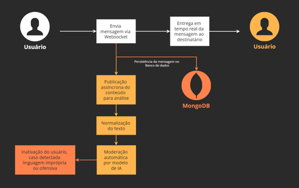
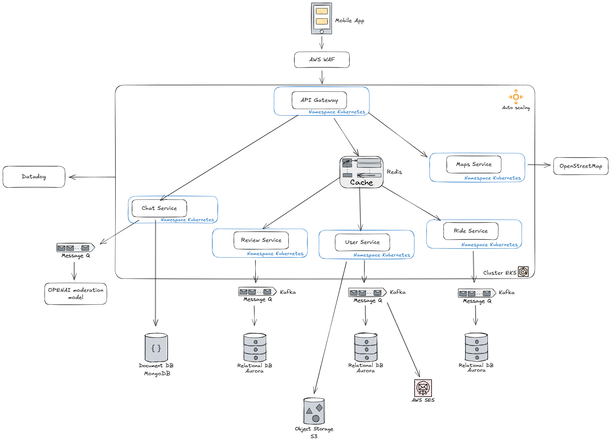

# Chat Service — Vai Comigo

Microsserviço responsável pela comunicação em tempo real entre motorista e passageiros vinculados a uma carona (ride), com persistência de mensagens em MongoDB e moderação assíncrona de conteúdo usando OpenAI Moderation (pós-envio, não bloqueante).

## Visão geral

O Chat Service provê um canal de mensagens em tempo real para facilitar o alinhamento logístico de caronas (horário, ponto de encontro, avisos rápidos). Para preservar a fluidez da conversa, a plataforma adota moderação assíncrona: a mensagem é entregue imediatamente via WebSocket e, em seguida, é analisada por um pipeline de moderação. Caso seja identificada linguagem ofensiva/imprópria, a mensagem pode ser marcada como FLAGGED, e o usuário autor pode ser inativado/suspenso conforme política.

## Principais responsabilidades

- **Comunicação bidirecional via WebSocket** (baixa latência)
- **Organização por salas** (1 sala por rideId)
- **Persistência de mensagens e metadados** em MongoDB
- **Autorização**: só participa do chat quem pertence à carona
- **Moderação assíncrona**:
  - normalização do texto para reduzir tentativas de burlar filtros
  - envio do texto normalizado para moderação (OpenAI)
  - ação pós-moderação: FLAGGED/REMOVED, e possível inativação do usuário

## Stack e dependências

- Node.js + TypeScript
- NestJS (`@nestjs/websockets`, `@nestjs/platform-socket.io`)
- MongoDB + Mongoose
- Redis (opcional, para rate limiting, presença e/ou pub/sub em escala)
- OpenAI Moderation API (para classificação de conteúdo)
- Docker / docker-compose (ambiente local)
- Bull + Redis (fila assíncrona para moderação)

## Fluxo de Moderação:


## Pipeline de moderação (assíncrono)

### 1) Normalização

Antes de enviar à IA, aplicar normalizações para reduzir bypass:

- reduzir espaços e separações artificiais
- mapear substituições comuns (0→o, 1→i, @→a, etc.)
- normalizar unicode (NFKC) e remover caracteres invisíveis

### 2) Chamada à OpenAI Moderation

- Enviar `contentNormalized` ao endpoint de moderação
- Armazenar no documento o resultado resumido (categorias e score)

### 3) Ações pós-moderação

Se conteúdo for classificado como impróprio:

- atualizar `status=FLAGGED` (ou REMOVED, conforme política)
- inativar usuário (User Service) via HTTP interno
- emitir evento `chat.message.flagged` para a sala
- registrar log/auditoria do incidente


## Arquitetura
O Chat Service está inserido na seguinte arquitetura:


## Modelo de dados (MongoDB)

### Message

- `id` (ObjectId/UUID)
- `rideId` (string/uuid)
- `senderId` (string/uuid)
- `content` (string)
- `contentNormalized` (string)
- `status` (ACTIVE | FLAGGED | REMOVED)
- `moderation` (objeto com resultado resumido)
- `createdAt`, `updatedAt`

### ChatRoom (opcional)

- `rideId`
- `participantIds` (lista)
- `createdAt`

**Observação**: em ambientes distribuídos, a "presença" e broadcast entre múltiplos pods pode exigir Redis adapter ou outra estratégia.

## Eventos WebSocket

### Conexão e autenticação

Handshake deve receber:

- `Authorization: Bearer <JWT>` ou
- headers internos (via API Gateway), ex.: `x-user-id`, `x-correlation-id`

### `chat.join`

**Payload:**
```json
{ "rideId": "..." }
```

**Comportamento:**

- valida se o usuário pertence à carona
- adiciona o socket à room `ride:<rideId>`

### `chat.message.send`

**Payload:**
```json
{ "rideId": "...", "content": "texto da mensagem" }
```

**Comportamento:**

- valida autorização (usuário pertence à carona)
- persiste mensagem com `status=ACTIVE`
- emite para room `ride:<rideId>` o evento `chat.message.new`
- dispara pipeline assíncrono de moderação (não bloqueante)

### `chat.message.new` (server → clients)

**Payload:**
```json
{
  "id": "...",
  "rideId": "...",
  "senderId": "...",
  "content": "...",
  "status": "ACTIVE",
  "createdAt": "..."
}
```

### `chat.message.flagged` (server → clients)

**Payload:**
```json
{
  "id": "...",
  "rideId": "...",
  "status": "FLAGGED"
}
```

## Exemplo de cliente WebSocket

```typescript
import io from 'socket.io-client';

const socket = io('http://localhost:3001');

socket.on('connect', () => {
  console.log('Conectado');
  
  // Entrar em sala
  socket.emit('chat.join', { rideId: '507f1f77bcf86cd799439011' });
});

// Receber mensagens
socket.on('chat.message.new', (data) => {
  console.log('Nova mensagem:', data);
});

// Enviar mensagem
socket.emit('chat.message.send', {
  rideId: '507f1f77bcf86cd799439011',
  content: 'Olá!'
});

// Notificação de mensagem flagged
socket.on('chat.message.flagged', (data) => {
  console.log('Mensagem flagged:', data);
});
```

## Considerações de Escalabilidade

- **Redis Adapter**: para distribuição de eventos entre múltiplos pods (Socket.IO)
- **Índices MongoDB**: em `rideId`, `senderId`, `status` para queries eficientes
- **Fila Bull**: permite retries automáticos e processamento assíncrono sem bloquear WebSocket
- **Load Balancing**: cada instância pode gerenciar ~10k conexões
